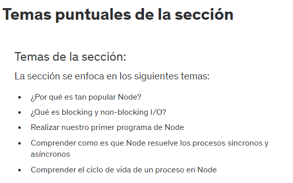

# 6. Introduccion a la seccion

# 7. Temas puntuales de la seccion



# 8. Preguntas comunes sobre Node

**¿Que es Node?:** Node.js es un entorno de tiempo de ejecucion de JavaScript de codigo abierto que permite a los desarrolladores ejecutar codigo JavaScript en el lado del servidor. Un entorno de tiempo de ejecucion se refiere a un sistema que proporciona un entorno en el que se ejecuta y se gestiona el codigo de un programa o aplicacion.

**¿Que puedo hacer con Node?:** 
- Uso de Sockets para una comunicacion real Cliente-Servidor: Puedes utilizar Node.js junto con la biblioteca Socket.io para implementar comunicación en tiempo real entre el cliente y el servidor. Esto es útil en aplicaciones de chat en vivo, juegos multijugador y sistemas de colaboración en tiempo real.
- Manejo de archivos en FileSystem, cargas simultaneas: Node.js facilita el manejo de archivos en el servidor. Puedes crear una aplicación que permita a los usuarios cargar archivos y gestionarlos. 
- Servidores locales y remotos con informacion en tiempo real: Puedes crear servidores locales o remotos con Node.js y transmitir información en tiempo real a través de WebSockets o eventos. Esto es útil para monitorear sistemas, recibir actualizaciones en tiempo real o transmitir datos en tiempo real a través de la red.
- Conexiones a base de datos: Node.js se integra con bases de datos relacionales y NoSQL. Por ejemplo, puedes utilizar el módulo mysql o mongoose para conectarte a bases de datos MySQL o MongoDB, respectivamente, y realizar operaciones de lectura y escritura de datos en la base de datos.
- Creacion de servicios REST en segundos: Puedes crear servicios RESTful fácilmente con Node.js y el framework Express.js.

En términos sencillos, un servicio REST o RESTful es una forma de organizar y acceder a información a través de internet. Es como una manera de pedir y compartir datos entre aplicaciones o páginas web.

Aquí hay un ejemplo fácil de entender:

Imagina que tienes una aplicación de chat. Quieres ver tus mensajes, así que presionas un botón. Ese botón envía una solicitud al servidor (computadora en la nube) preguntando "¿Cuáles son mis mensajes?". El servidor te responde con una lista de tus mensajes. Esto es un ejemplo de un servicio REST en acción. Tú, como usuario de la aplicación, solicitas datos al servidor y obtienes una respuesta.

En resumen, REST es una forma de pedir y recibir información a través de internet de manera organizada y fácil de entender.

# 9. Blocking vs Non Blocking I/O

"Blocking" y "Non-blocking" (bloqueante y no bloqueante, respectivamente) se refieren a cómo una aplicación o programa maneja las operaciones de entrada/salida (I/O, Input/Output), como lectura/escritura de archivos o comunicación con bases de datos o redes. Estos conceptos son especialmente relevantes en programación y desarrollo de software.

Blocking I/O (I/O bloqueante):
Cuando una operación de I/O es bloqueante, significa que la aplicación se detiene y espera hasta que la operación se complete antes de continuar con otras tareas. Durante el tiempo que la operación de I/O está en curso, la aplicación no puede realizar ninguna otra acción.

Ejemplo textual:
Imagina que tienes un programa que debe leer un archivo grande línea por línea de manera bloqueante. Cuando llega a una línea larga, el programa se queda inactivo hasta que termine de leer esa línea, lo que significa que no puede hacer nada más mientras espera.

Non-blocking I/O (I/O no bloqueante):
En el caso de I/O no bloqueante, la aplicación no se detiene y espera a que la operación de I/O se complete. En lugar de eso, la aplicación puede iniciar la operación de I/O y seguir haciendo otras tareas mientras espera a que la operación se complete. Esto se logra mediante el uso de callbacks, promesas o eventos para manejar la finalización de la operación de I/O.

Ejemplo textual:
Supongamos que tienes un programa que debe leer un archivo línea por línea de manera no bloqueante. En lugar de esperar a que cada línea se lea completamente, el programa inicia la lectura de una línea y, mientras espera, puede hacer otras cosas. Cuando la línea se ha leído, se ejecuta una función de callback que procesa la línea.

La elección entre I/O bloqueante y no bloqueante depende de los requisitos de tu aplicación y del rendimiento deseado. Las operaciones de I/O no bloqueante son especialmente útiles en aplicaciones en tiempo real y de alto rendimiento, ya que permiten que la aplicación continúe respondiendo a otras solicitudes y eventos mientras espera que se completen las operaciones de I/O. Por otro lado, las operaciones de I/O bloqueante pueden simplificar la lógica de programación en algunos casos, pero también pueden llevar a una aplicación menos receptiva y menos eficiente en términos de recursos.

# 10. Hola Mundo en Node

Para ejecutar un archivo js desde el servidor usando node ponemos el comando ubicados en el directori correcto: node nombreDelArchivo.js

```js
/*let nombre = 'Fernando';
console.log(nombre);

nombre = 'Juan';
console.log(nombre);*/

console.log('Hola Mundo');
```

# 11. Ciclo de eventos de Node - Ejemplos

```js
const saludar = (nombre) => {
    return `Saludos ${ nombre }`;
}

console.log(saludar('Fernando'));
```

```js
console.log('Inicio de programa');

setTimeout(() => {
    console.log('Primer Timeout');
}, 3000);

setTimeout(() => {
    console.log('Segundo Timeout');
}, 0);

setTimeout(() => {
    console.log('Tercer Timeout');
}, 0);

console.log('Fin de programa');
```

# 12. Ciclo de vida de un proceso en Node

Pila de procesos (Call Stack) <=> Node Apis <=> Cola de callbacks

# 13. Nodemon

Nodemon es una herramienta que ayuda a desarrollar aplicaciones en Node.js reiniciando automáticamente la aplicación del servidor cuando detecta cambios en los archivos del proyecto. Esto elimina la necesidad de reiniciar manualmente el servidor cada vez que se hacen modificaciones, lo que mejora la eficiencia del desarrollo.

https://www.npmjs.com/package/nodemon

Para instalarlo de manera global ponemos el siguiente comando:

npm install -g nodemon # or using yarn: yarn global add nodemon

# 14. Codigo fuente de la seccion

https://github.com/Klerith/node-hola-mundo/releases/tag/v0.1.0