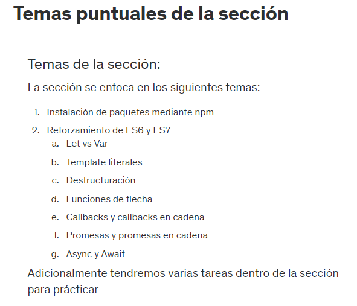

# 15. Introducción a la seccion

# 16. Temas puntuales de la sección



# 17. Const vs Let vs Var

En JavaScript, las variables se pueden declarar usando las palabras clave var, let o const.

**Alcance:** El alcance de una variable determina en qué parte del código se puede acceder a ella. Las variables declaradas con var tienen un alcance global o de función, mientras que las variables declaradas con let y const tienen un alcance de bloque.

**Hoisting:** Las declaraciones de variables var y let se elevan a la parte superior de su ámbito. Esto significa que las variables se pueden utilizar antes de su declaración, pero su valor será undefined si no se ha asignado previamente. Las declaraciones de variables const no se elevan. Esto significa que las variables no se pueden utilizar antes de su declaración.

**Recomendaciones:** Se recomienda utilizar la palabra clave const para declarar variables que no se vayan a modificar. Esto ayuda a mejorar la legibilidad y la mantenibilidad del código.

```js
var nombre = 'Juan';

console.log(nombre);

//La salida es Juan
```

```js
console.log(nombre);

var nombre = 'Juan';

//La salida es undefined
```

```js
const nombre2 = 'Luis';

console.log(nombre2);

//La salida da Luis
```

```js
console.log(nombre2);

const nombre2 = 'Luis';

//La salida da un error
```

# 18. Templates literales

```js
const nombre = 'Deadpool';
const real = 'Wade Winston';

//PRIMERA FORMA
const normal = nombre + ' ' + real;

//SEGUNDA FORMA
const template = `${nombre} ${real}`;

console.log(normal);
console.log(template);


const html = `
<h1>Hola</h1>
<p>Mundo</p>
`;

console.log(html);
/*SALIDA
<h1>Hola</h1>
<p>Mundo</p>
*/

```

# 19. Destructuracion de objetos

En JavaScript, la desestructuración es una técnica que permite extraer valores de un arreglo o objeto y asignarlos a nuevas variables.

**Desestructuración de arreglos:** La desestructuración de arreglos se utiliza para extraer valores individuales de un arreglo. La sintaxis es la siguiente:

```js
const arreglo = [1, 2, 3];

// Desestructuración de arreglo
const [valor1, valor2, valor3] = arreglo;

console.log(valor1); // 1
console.log(valor2); // 2
console.log(valor3); // 3

```

**Desestructuración de objetos:** La desestructuración de objetos se utiliza para extraer propiedades individuales de un objeto. La sintaxis es la siguiente:

```js
const objeto = {
  nombre: "Juan",
  edad: 30,
  fechaNacimiento: new Date(1993, 05, 21)
};

// Desestructuración de objeto
const { nombre, edad, fechaNacimiento } = objeto;

console.log(nombre); // Juan
console.log(edad); // 30
console.log(fechaNacimiento); // 21-05-1993

```

**Ventajas de la desestructuración:** La desestructuración tiene las siguientes ventajas:

Mejora la legibilidad y la mantenibilidad del código.
Reduce la cantidad de código.
Permite acceder a los valores de un arreglo o objeto de forma más sencilla.

```js
const deadpool = {
    nombre: 'Wade',
    apellido: 'Winston',
    poder: 'Regeneracion',
    getNombre() {
        return `${this.nombre} ${this.apellido} ${this.poder}`;
    }
}
console.log(deadpool.getNombre());

//PRIMERA FORMA
const nombre1 = deadpool.nombre;
const apellido1 = deadpool.apellido;
const poder1 = deadpool.poder;

console.log(nombre1, apellido1, poder1);

//SEGUNDA FORMA-FORMA DESESTRUCTURADA
const {nombre,apellido,poder} = deadpool;
console.log(nombre, apellido, poder);

//TAMBIEN SE PUEDE HACER LO SIGUIENTE
/*
const {nombre, apellido, poder, edad=0} = deadpool;
console.log(nombre, apellido, poder, edad);
*/
//La salida en edad seria undefined, pero como se le puso edad=0 la salida es 0

function imprimeHeroe(heroe) {
    const {nombre, apellido, poder, edad = 0} = heroe;
    console.log(nombre, apellido, poder, edad);
}
imprimeHeroe(deadpool);

//OTRA FORMA DE DESESTRUCTURAR ESA FUNCION ES EN LOS ARGUMENTOS
function imprimeHeroe2({nombre, apellido, poder, edad = 5}) {
    console.log(nombre, apellido, poder, edad);
}
imprimeHeroe2(deadpool);

const heroes = ['Deadpool', 'Superman', 'Batman'];
const h1 = heroes[0];
const h2 = heroes[1];
const h3 = heroes[2];

console.log(h1, h2, h3);

// DESESCTRUCTURANDO UN ARREGLO
const [h11, h22, h33] = heroes;
console.log(h11, h22, h33);
//La salida es Deadpool Superman Batman

//CUANDO SOLO QUIERO UN ELEMENTO DESESTRUCTURAR
const [, , h333] = heroes;
console.log(h333);
//La salida es Batman
```

# 20. Funciones de Flecha

Las funciones de flecha en JavaScript son una nueva sintaxis que se introdujo en la versión ES6 del lenguaje. Son una forma concisa de definir funciones que pueden ser útiles para una variedad de tareas.

**Sintaxis:** La sintaxis básica de una función de flecha es la siguiente

```js
// Función de flecha con un parámetro
const sumaDos = (numero) => numero + 2;

// Función de flecha con múltiples parámetros
const multiplicarNumeros = (numero1, numero2) => numero1 * numero2;

// Función de flecha sin parámetros
const saludar = () => console.log("Hola, mundo!");
```

**Características:** Las funciones de flecha tienen las siguientes características:

- Sin llaves: Las funciones de flecha no requieren llaves para encerrar el cuerpo de la función.
- Sin return: Las funciones de flecha pueden devolver un valor implícito si el cuerpo de la función es una expresión.
- No tiene this: Las funciones de flecha no tienen una referencia a this.

# 21. Callbacks

Los callbacks en JavaScript son funciones que se pasan como argumentos a otras funciones. Se utilizan para ejecutar código después de que se complete una tarea o operación.

**Sintaxis:** La sintaxis básica de un callback es la siguiente:

```js
function funcion(callback) {
  // ...
  callback();
}
```

En este ejemplo, la función funcion() tiene un parámetro llamado callback. El parámetro callback es una función que se ejecutará después de que se complete la función funcion().

**Ejemplo 1: Imprimir un mensaje despues de un retraso:**
```js
function imprimirMensaje(mensaje, callback) {
  setTimeout(() => {
    // Imprime el mensaje
    console.log(mensaje);

    // Ejecuta el callback
    callback();
  }, 1000);
}

// Llamada a la función
imprimirMensaje("Hola, mundo!", () => {
  // Hace algo después de imprimir el mensaje
  console.log("¡Listo!");
});
```

En este ejemplo, la función imprimirMensaje() imprime un mensaje después de un retraso de 1 segundo. El callback se utiliza para ejecutar código después de que se imprima el mensaje.

**Ejemplo 2: Realizar una solicitud HTTP asincronica:**

```js
function solicitar(url, callback) {
  // Realiza la solicitud HTTP
  // ...

  // Ejecuta el callback
  callback(respuesta);
}

// Función para procesar la respuesta HTTP
function procesarRespuesta(respuesta) {
  // Imprime la respuesta
  console.log(respuesta);
}

// Llamada a la función
solicitar("https://example.com", procesarRespuesta);
```
En este ejemplo, la función solicitar() realiza una solicitud HTTP a la URL especificada. El callback procesarRespuesta() se utiliza para procesar la respuesta de la solicitud HTTP.

En ambos ejemplos, el callback se pasa como argumento a la función que realiza la tarea principal. La función que realiza la tarea principal ejecuta el callback después de que se complete la tarea.

```js
//CALLBACK
setTimeout(function() {
    console.log('Hola Mundo');
}, 3000);

//CON FUNCION DE FLECHA
setTimeout(() => {
    console.log('Hola Mundo');
}, 2000);


const getUsuarioByID = (id) => {
    const usuario = {
        id,
        nombre: 'Fernando'
    }
    setTimeout(() => {
        console.log(usuario);
    }, 4000);
}
//getUsuarioByID(10);

getUsuarioByID(10, () => {
    console.log('hola mundo');
});
/*Vemos que no se dispara el hola mundo, para ello debemos hacer lo siguiente

const getUsuarioByID = (id, callback) => {
    const usuario = {
        id,
        nombre: 'Fernando'
    }
    setTimeout(() => {
        callback(usuario);
    }, 4000);
}
//getUsuarioByID(10);

getUsuarioByID(10, () => {
    console.log('hola mundo');
});

Ahora la salida sale el hola mundo, pero ahora yo quiero imprimir el usuario . Eso lo hariamos asi:

const getUsuarioByID = (id) => {
    const usuario = {
        id,
        nombre: 'Fernando'
    }
    setTimeout(() => {
        console.log(usuario);
    }, 4000);
}
//getUsuarioByID(10);

getUsuarioByID(10, (usuario) => {
    console.log(usuario);
});
*/

function imprimirMensaje(mensaje, callback) {
    setTimeout(() => {
      // Imprime el mensaje
      console.log(mensaje);
  
      // Ejecuta el callback
      callback();
    }, 1000);
  }
  
  // Llamada a la función
  imprimirMensaje("Hola, mundo!", () => {
    // Hace algo después de imprimir el mensaje
    console.log("¡Listo!");
  });
```

# 22. Problemas comunes con los callbacks

```js
//OBTENIENDO EMPLEADO CON ID EXISTENTE
const empleados = [
    {
        id: 1,
        nombre: 'Fernando'
    },
    {
        id: 2,
        nombre: 'Linda'
    },
    {
        id: 3,
        nombre: 'Karen'
    }
];
const salarios = [
    {
        id: 1,
        salario: 1000
    },
    {
        id: 2,
        salario: 1500
    }
];
const getEmpleado = (id) => {
    const empleado = empleados.find(e => e.id === id)
    return empleado;
}
console.log(getEmpleado(1));
```

```js
//OBTENIENDO EMPLEADO SIN ID EXISTENTE
const empleados = [
    {
        id: 1,
        nombre: 'Fernando'
    },
    {
        id: 2,
        nombre: 'Linda'
    },
    {
        id: 3,
        nombre: 'Karen'
    }
];
const salarios = [
    {
        id: 1,
        salario: 1000
    },
    {
        id: 2,
        salario: 1500
    }
];
const getEmpleado = (id) => {
    const empleado = empleados.find(e => e.id === id)
    if (empleado) {
        return empleado;
    } else {
        return `Empleado con id ${id} no existe`;
    }
}
console.log(getEmpleado(5));
```

```js
const empleados = [
    {
        id: 1,
        nombre: 'Fernando'
    },
    {
        id: 2,
        nombre: 'Linda'
    },
    {
        id: 3,
        nombre: 'Karen'
    }
];
const salarios = [
    {
        id: 1,
        salario: 1000
    },
    {
        id: 2,
        salario: 1500
    }
];
const getEmpleado = (id, callback) => {
    const empleado = empleados.find(e => e.id === id)
    if (empleado) {
        callback(null, empleado);
    } else {
        callback(`Empleado con id ${id} no existe`);
    }
}
getEmpleado(1, (err, empleado) => {
    if (err) {
        console.log('ERROR!');
        return console.log(err);
    }
    console.log('Empleado existe!');
    console.log(empleado);
})
```

# 23. Callback Hell

```js
const empleados = [
    {
        id: 1,
        nombre: 'Fernando'
    },
    {
        id: 2,
        nombre: 'Linda'
    },
    {
        id: 3,
        nombre: 'Karen'
    }
];
const salarios = [
    {
        id: 1,
        salario: 1000
    },
    {
        id: 2,
        salario: 1500
    }
];
const getEmpleado = (id, callback) => {
    const empleado = empleados.find(e => e.id === id)
    if (empleado) {
        callback(null, empleado);
    } else {
        callback(`Empleado con id ${id} no existe`);
    }
}

const getSalario = (id, callback) => {
    const salario = salarios.find(e => e.id === id)?.salario
    if (salario) {
        callback(null, salario);
    } else {
        callback(`Salario con id ${id} no existe`);
    }
}

getEmpleado(1, (err, empleado) => {
    if (err) {
        console.log('ERROR!');
        return console.log(err);
    }
    console.log('Empleado existe!');
    console.log(empleado.nombre);
});

getSalario(10, (err, salario) => {
    if (err) {
        console.log('ERROR!');
        return console.log(err);
    }
    console.log('Salario existe!');
    console.log(salario);
})
```

```js
const empleados = [
    {
        id: 1,
        nombre: 'Fernando'
    },
    {
        id: 2,
        nombre: 'Linda'
    },
    {
        id: 3,
        nombre: 'Karen'
    }
];
const salarios = [
    {
        id: 1,
        salario: 1000
    },
    {
        id: 2,
        salario: 1500
    }
];
const getEmpleado = (id, callback) => {
    const empleado = empleados.find(e => e.id === id)?.nombre
    if (empleado) {
        callback(null, empleado);
    } else {
        callback(`Empleado con id ${id} no existe`);
    }
}

const getSalario = (id, callback) => {
    const salario = salarios.find(e => e.id === id)?.salario
    if (salario) {
        callback(null, salario);
    } else {
        callback(`Salario con id ${id} no existe`);
    }
}

const id= 3;

getEmpleado(id, (err, empleado) => {
    if (err) {
        console.log('ERROR!');
        return console.log(err);
    }
    getSalario(id, (err, salario) => {
        if (err) {
            console.log('ERROR!');
            return console.log(err);
        }
        console.log('El empleado:',empleado, 'tiene un salario de:', salario);
    })
});
```

# 24. Promesas

En JavaScript, una promesa es una forma de manejar operaciones asíncronas de manera más ordenada y fácil de entender. Las promesas representan una promesa de que una operación se completará en el futuro, ya sea con éxito o con un error.

Las promesas en JavaScript son objetos que representan el resultado de una operación asíncrona. Pueden estar en uno de los siguientes estados:

- Pendiente: La promesa aún no se ha resuelto o rechazado.
- Cumplida: La promesa se ha resuelto con éxito y tiene un valor.
- Rechazada: La promesa se ha rechazado con un error.


Las promesas se utilizan para manejar la asincronía en JavaScript de una manera segura y eficiente. Permiten que el código no se bloquee mientras se espera el resultado de una operación asíncrona.

**Creación de promesas:** Las promesas se pueden crear de varias maneras. Una forma es usar la función new Promise():

```js
const promesa = new Promise((resolve, reject) => {
  // código asíncrono
  resolve(resultado);
});
```

Otra forma de crear promesas es usar la función async/await:

```js
const resultado = await promesa;
```

**Consumidor de promesas:** Las promesas se consumen usando el método then(). El método then() acepta dos funciones de devolución de llamada:

- resolve() se llama cuando la promesa se resuelve con éxito.
- reject() se llama cuando la promesa se rechaza con un error.

```js
const promesa = new Promise((resolve, reject) => {
  // código asíncrono
  resolve(resultado);
});

promesa
  .then((resultado) => {
    // código que se ejecuta cuando la promesa se resuelve
  })
  .catch((error) => {
    // código que se ejecuta cuando la promesa se rechaza
  });
```

**Cadena de promesas:** Las promesas se pueden encadenar usando el método then(). Esto permite ejecutar una serie de operaciones asíncronas de forma secuencial.

```js
const promesa1 = new Promise((resolve, reject) => {
  // código asíncrono
  resolve(resultado1);
});

const promesa2 = new Promise((resolve, reject) => {
  // código asíncrono
  resolve(resultado2);
});

promesa1
  .then((resultado1) => {
    // código que se ejecuta después de que se resuelva la promesa1
    return promesa2;
  })
  .then((resultado2) => {
    // código que se ejecuta después de que se resuelva la promesa2
  });
```

**Errores en promesas:** Las promesas pueden rechazarse con un error. Cuando esto sucede, el método reject() se llama con un objeto de error como argumento.

```js
const promesa = new Promise((resolve, reject) => {
  // código asíncrono que puede fallar
  reject(new Error("Error"));
});

promesa
  .then((resultado) => {
    // código que se ejecuta cuando la promesa se resuelve
  })
  .catch((error) => {
    // código que se ejecuta cuando la promesa se rechaza
    console.log(error); // Error: Error
  });
```

**Beneficios de las promesas:** Las promesas ofrecen varios beneficios sobre las funciones de devolución de llamada tradicionales:

- Seguridad: Las promesas garantizan que el código no se bloquee mientras se espera el resultado de una operación asíncrona.
- Eficiencia: Las promesas permiten que el código se ejecute de forma asíncrona, lo que puede mejorar el rendimiento de la aplicación.
- Facilidad de uso: Las promesas son fáciles de aprender y usar.

**Operacion asincrona:** Una operación asíncrona se refiere a una acción o tarea que no se ejecuta de manera inmediata en el orden secuencial de un programa. En lugar de eso, la operación se inicia, pero el programa continúa su ejecución sin esperar a que la operación se complete. Las operaciones asíncronas son comunes en el contexto de la programación en situaciones donde la tarea puede llevar tiempo, como la lectura de un archivo grande, la obtención de datos de una base de datos remota o la solicitud de información a través de una red.

Un ejemplo sencillo para ilustrar la asincronía es una solicitud de una página web. Cuando visitas un sitio web, tu navegador realiza múltiples solicitudes asíncronas para cargar recursos como imágenes, scripts y hojas de estilo mientras muestra el contenido principal. Esto significa que no tienes que esperar a que se cargue cada recurso antes de ver la página principal; en su lugar, el navegador carga estos recursos de manera asíncrona y los muestra en cuanto estén listos.

En JavaScript, la asincronía se maneja comúnmente con el uso de callbacks, promesas o async/await para ejecutar tareas en segundo plano y controlar cuándo y cómo se manejan los resultados. Esto es fundamental para evitar bloqueos en la interfaz de usuario de una aplicación y garantizar que sea receptiva para el usuario, incluso cuando se realizan tareas que pueden llevar tiempo.

```js
const empleados = [
    {
        id: 1,
        nombre: 'Fernando'
    },
    {
        id: 2,
        nombre: 'Linda'
    },
    {
        id: 3,
        nombre: 'Karen'
    }
];
const salarios = [
    {
        id: 1,
        salario: 1000
    },
    {
        id: 2,
        salario: 1500
    }
];

const getEmpleado = (id) => {
    const promesa = new Promise((resolve, reject) => {
        const empleado = empleados.find(e => e.id === id)?.nombre
        if (empleado) {
            resolve(empleado);
        } else {
            reject(`No existe empleado con id ${id}`)
        }
    });
    return promesa;
}

const id = 4;
getEmpleado(id)
    .then(empleado => console.log(empleado))
    .catch(err => console.log(err));
```

```js
const empleados = [
    {
        id: 1,
        nombre: 'Fernando'
    },
    {
        id: 2,
        nombre: 'Linda'
    },
    {
        id: 3,
        nombre: 'Karen'
    }
];
const salarios = [
    {
        id: 1,
        salario: 1000
    },
    {
        id: 2,
        salario: 1500
    }
];

const getEmpleado = (id) => {
    return new Promise((resolve, reject) => {
        const empleado = empleados.find(e => e.id === id)?.nombre;
        (empleado)
            ? resolve(empleado)
            : reject(`No existe empleado con id ${id}`);
    })
};

const getSalario = (id) => {
    return new Promise((resolve, reject) => {
        const salario = salarios.find(e => e.id === id)?.salario;
        (salario)
            ? resolve(salario)
            : reject(`No existe salario con id ${id}`);
    })
};

const id = 3;
getEmpleado(id)
    .then(empleado => console.log(empleado))
    .catch(err => console.log(err));

getSalario(id)
    .then(salario => console.log(salario))
    .catch(err => console.log(err));
```

```js
const empleados = [
    {
        id: 1,
        nombre: 'Fernando'
    },
    {
        id: 2,
        nombre: 'Linda'
    },
    {
        id: 3,
        nombre: 'Karen'
    }
];
const salarios = [
    {
        id: 1,
        salario: 1000
    },
    {
        id: 2,
        salario: 1500
    }
];

const getEmpleado = (id) => {
    return new Promise((resolve, reject) => {
        const empleado = empleados.find(e => e.id === id)?.nombre;
        (empleado)
            ? resolve(empleado)
            : reject(`No existe empleado con id ${id}`);
    })
};

const getSalario = (id) => {
    return new Promise((resolve, reject) => {
        const salario = salarios.find(e => e.id === id)?.salario;
        (salario)
            ? resolve(salario)
            : reject(`No existe salario con id ${id}`);
    })
};

const id = 3
// getEmpleado(id)
//     .then(empleado => console.log(empleado))
//     .catch(err => console.log(err));

// getSalario(id)
//     .then(salario => console.log(salario))
//     .catch(err => console.log(err));

getEmpleado(id)
    .then(empleado => {
        getSalario(id)
            .then(salario => {
                console.log('El empleado:', empleado, 'tiene un salario de: ', salario);
            })
            .catch(err => console.log(err))
    })
    .catch(err => console.log(err))
```

# 25. Promesas en cadena

```js
const empleados = [
    {
        id: 1,
        nombre: 'Fernando'
    },
    {
        id: 2,
        nombre: 'Linda'
    },
    {
        id: 3,
        nombre: 'Karen'
    }
];
const salarios = [
    {
        id: 1,
        salario: 1000
    },
    {
        id: 2,
        salario: 1500
    }
];

const getEmpleado = (id) => {
    return new Promise((resolve, reject) => {
        const empleado = empleados.find(e => e.id === id)?.nombre;
        (empleado)
            ? resolve(empleado)
            : reject(`No existe empleado con id ${id}`);
    })
};

const getSalario = (id) => {
    return new Promise((resolve, reject) => {
        const salario = salarios.find(e => e.id === id)?.salario;
        (salario)
            ? resolve(salario)
            : reject(`No existe salario con id ${id}`);
    })
};

const id = 1
getEmpleado(id)
    .then(empleado => getSalario(id))
    .then(salario => console.log(salario));
```

```js
const empleados = [
    {
        id: 1,
        nombre: 'Fernando'
    },
    {
        id: 2,
        nombre: 'Linda'
    },
    {
        id: 3,
        nombre: 'Karen'
    }
];
const salarios = [
    {
        id: 1,
        salario: 1000
    },
    {
        id: 2,
        salario: 1500
    }
];

const getEmpleado = (id) => {
    return new Promise((resolve, reject) => {
        const empleado = empleados.find(e => e.id === id)?.nombre;
        (empleado)
            ? resolve(empleado)
            : reject(`No existe empleado con id ${id}`);
    })
};

const getSalario = (id) => {
    return new Promise((resolve, reject) => {
        const salario = salarios.find(e => e.id === id)?.salario;
        (salario)
            ? resolve(salario)
            : reject(`No existe salario con id ${id}`);
    })
};

let nombre;
const id = 3

getEmpleado(id)
    .then(empleado => {
        nombre = empleado;
        return getSalario(id)
    })
    .then(salario => console.log('El empleado:', nombre, 'tiene un salario de:', salario))
    .catch(err => console.log(err));
```

# 26. Async - Await

```js
const empleados = [
    {
        id: 1,
        nombre: 'Fernando'
    },
    {
        id: 2,
        nombre: 'Linda'
    },
    {
        id: 3,
        nombre: 'Karen'
    }
];
const salarios = [
    {
        id: 1,
        salario: 1000
    },
    {
        id: 2,
        salario: 1500
    }
];

const getEmpleado = (id) => {
    return new Promise((resolve, reject) => {
        const empleado = empleados.find(e => e.id === id)?.nombre;
        (empleado)
            ? resolve(empleado)
            : reject(`No existe empleado con id ${id}`);
    })
};

const getSalario = (id) => {
    return new Promise((resolve, reject) => {
        const salario = salarios.find(e => e.id === id)?.salario;
        (salario)
            ? resolve(salario)
            : reject(`No existe salario con id ${id}`);
    })
};

const id = 1;

const getInfoUsuario = async() => {
    return 'Hola Mundo';
}
getInfoUsuario()
    .then(msg => console.log(msg));
```

```js
const empleados = [
    {
        id: 1,
        nombre: 'Fernando'
    },
    {
        id: 2,
        nombre: 'Linda'
    },
    {
        id: 3,
        nombre: 'Karen'
    }
];
const salarios = [
    {
        id: 1,
        salario: 1000
    },
    {
        id: 2,
        salario: 1500
    }
];

const getEmpleado = (id) => {
    return new Promise((resolve, reject) => {
        const empleado = empleados.find(e => e.id === id)?.nombre;
        (empleado)
            ? resolve(empleado)
            : reject(`No existe empleado con id ${id}`);
    })
};

const getSalario = (id) => {
    return new Promise((resolve, reject) => {
        const salario = salarios.find(e => e.id === id)?.salario;
        (salario)
            ? resolve(salario)
            : reject(`No existe salario con id ${id}`);
    })
};

const getInfoUsuario = async(id) => {
    try {
        const empleado = await getEmpleado(id);
        const salario = await getSalario(id);
        return `El salario del empleado: ${empleado} es de ${salario}`;
    } catch (error) {
        throw error;
    }
    
}

const id = 3;

getInfoUsuario(id)
    .then(msg => {
        console.log('TODO BIEN!')
        console.log(msg)})
    .catch(err => {
        console.log('TODO MAL!')
        console.log(err)});
```

# 27. Codigo fuente de la seccion