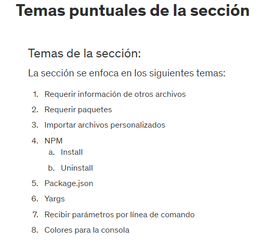

# 28. Introduccion a la seccion


# 29. Temas puntuales de la seccion



# 30. Inicio del proyecto - Seccion 4

```js
console.clear();
console.log('=====================');
console.log('    Tabla del: 5');
console.log('=====================');

const base = 5;

for (let i = 1; i <= 10; i++) {
    console.log(`${base} x ${i} = ${base * i}`);
}
```

# 31. Requerir paquetes - require

```js
const fs = require('fs');

console.clear();
console.log('=====================');
console.log('    Tabla del: 5');
console.log('=====================');

const base = 5;
let salida = '';

for (let i = 1; i <= 10; i++) {
    salida += `${base} x ${i} = ${base * i}\n`;
}
console.log(salida);

fs.writeFile('tabla-5.txt', salida, (err) => {
    if(err) throw err;
    console.log('tabla-5.txt creado');
})
```

```js
const fs = require('fs');

const base = 3;
console.clear();
console.log('=====================');
console.log(`    Tabla del: ${base}`);
console.log('=====================');

let salida = '';

for (let i = 1; i <= 10; i++) {
    salida += `${base} x ${i} = ${base * i}\n`;
}
console.log(salida);

fs.writeFile(`tabla-${base}.txt`, salida, (err) => {
    if(err) throw err;
    console.log(`tabla-${base}.txt creado`);
})
```

# 32. Importar archivos de nuestro proyecto

```js
const fs = require('fs');
const crearArchivo = (base = 5) => {

    console.log('=====================');
    console.log(`    Tabla del: ${base}`);
    console.log('=====================');

    let salida = '';

    for (let i = 1; i <= 10; i++) {
        salida += `${base} x ${i} = ${base * i}\n`;
    }
    console.log(salida);

    fs.writeFileSync(`tabla-${base}.txt`, salida);
    console.log(`tabla-${base}.txt creado`);
}

module.exports = {
    crearArchivo
}
```

```js
const {crearArchivo} = require('./helpers/multiplicar');

console.clear();

const base = 3;

crearArchivo(base);
```

**USANDO PROMESAS:**
```js
const fs = require('fs');
const crearArchivo = (base = 5) => {
    return new Promise ((resolve, reject) => {
        console.log('=====================');
        console.log(`    Tabla del: ${base}`);
        console.log('=====================');

        let salida = '';

        for (let i = 1; i <= 10; i++) {
            salida += `${base} x ${i} = ${base * i}\n`;
        }
        console.log(salida);

        fs.writeFileSync(`tabla-${base}.txt`, salida);
        resolve(`tabla-${base}.txt`);
    })
}
module.exports = {
    crearArchivo
}
```

```js
const {crearArchivo} = require('./helpers/multiplicar');

console.clear();

const base = 7;

crearArchivo(base)
    .then(nombreArchivo => console.log(nombreArchivo, 'creado'))
    .catch(err => console.log(err));
```

**USANDO ASYNC:**

```js
const fs = require('fs');
const crearArchivo = async(base = 5) => {
    try {
        console.log('=====================');
        console.log(`    Tabla del: ${base}`);
        console.log('=====================');

        let salida = '';

        for (let i = 1; i <= 10; i++) {
            salida += `${base} x ${i} = ${base * i}\n`;
        }
        console.log(salida);

        fs.writeFileSync(`tabla-${base}.txt`, salida);
        return `tabla-${base}.txt`;
    } catch (err) {
        throw err;
    }
}
module.exports = {
    crearArchivo
}
```

```js
const {crearArchivo} = require('./helpers/multiplicar');
console.clear();
const base = 9;
crearArchivo(base)
    .then(nombreArchivo => console.log(nombreArchivo, 'creado'))
    .catch(err => console.log(err));
```

# 33. Recibir informacion desde linea de comando

```js
const {crearArchivo} = require('./helpers/multiplicar');
console.clear();
const [, , arg3 = 'base=5'] = process.argv;
const [, base = 5] = arg3.split('=');
console.log(base);

//const base = 5;
crearArchivo(base)
    .then(nombreArchivo => console.log(nombreArchivo, 'creado'))
    .catch(err => console.log(err));
```

# 34. package.json - init - install - uninstall

# 35. Yargs

Yargs es una biblioteca de Node.js que ayuda a crear interfaces de línea de comandos (CLI) fáciles de usar. Permite a los desarrolladores definir opciones y argumentos para sus aplicaciones CLI, y proporciona una interfaz de usuario intuitiva para los usuarios.

Yargs ofrece una serie de características que lo convierten en una herramienta poderosa para crear CLI:

- Soporte para opciones y argumentos: Yargs permite a los desarrolladores definir opciones y argumentos para sus aplicaciones CLI. Las opciones son valores opcionales que pueden ser proporcionados por el usuario, mientras que los argumentos son valores obligatorios que siempre deben ser proporcionados.
- Análisis de parámetros: Yargs proporciona una API para analizar los parámetros proporcionados por el usuario. Esta API permite a los desarrolladores comprobar si se han proporcionado todos los parámetros obligatorios, y si los valores de los parámetros son válidos.
- Ayuda: Yargs puede generar una ayuda para la aplicación CLI. Esta ayuda proporciona información sobre las opciones y argumentos disponibles.

```js
const {crearArchivo} = require('./helpers/multiplicar');
const argv = require('yargs').argv;
console.clear();

console.log(process.argv);
console.log(argv);

console.log('base: yargs', argv.base);

//const base = 5;
// crearArchivo(base)
//     .then(nombreArchivo => console.log(nombreArchivo, 'creado'))
//     .catch(err => console.log(err));
```

# 36. Configuraciones de Yargs

```js
const {crearArchivo} = require('./helpers/multiplicar');
const argv = require('yargs')
                .option('b', {
                    alias: 'base',
                    type: 'number',
                    demandOption: true
                })
                .option('l', {
                    alias: 'listar',
                    type: 'boolean',
                    demandOption: true,
                    default: false
                })
                .check((argv, options) => {
                    if (isNaN(argv.b)) {
                        throw 'La base tiene que ser un numero'
                    }
                    return true;
                })
                .argv;
console.clear();

crearArchivo(argv.b, argv.l)
    .then(nombreArchivo => console.log(nombreArchivo, 'creado'))
    .catch(err => console.log(err));
```

```js
const fs = require('fs');
const crearArchivo = async(base = 5, listar = false) => {
    try {
        let salida = '';

        for (let i = 1; i <= 10; i++) {
            salida += `${base} x ${i} = ${base * i}\n`;
        }
        if (listar) {
            console.log('=====================');
            console.log(`    Tabla del: ${base}`);
            console.log('=====================');

            console.log(salida);
        }
        fs.writeFileSync(`tabla-${base}.txt`, salida);
        return `tabla-${base}.txt`;
    } catch (err) {
        throw err;
    }
}
module.exports = {
    crearArchivo
}
```

# 37. Configuracion de Yargs independente

```js
const {crearArchivo} = require('./helpers/multiplicar');
const argv = require('./config/yargs');
console.clear();

crearArchivo(argv.b, argv.l)
    .then(nombreArchivo => console.log(nombreArchivo, 'creado'))
    .catch(err => console.log(err));
```

```js
const argv = require('yargs')
    .option('b', {
        alias: 'base',
        type: 'number',
        demandOption: true,
        describe: 'Es la base de la tabla de multiplicar'
    })
    .option('l', {
        alias: 'listar',
        type: 'boolean',
        default: false,
        describe: 'Muestra la tabla en consola'
    })
    .check((argv, options) => {
        if (isNaN(argv.b)) {
            throw 'La base tiene que ser un numero'
        }
        return true;
    })
    .argv;

module.exports = argv;
```

# 38. Colores de la consola

```js
const fs = require('fs');
const colors = require('colors');
const crearArchivo = async(base = 5, listar = false) => {
    try {
        let salida = '';

        for (let i = 1; i <= 10; i++) {
            salida += `${base} x ${i} = ${base * i}\n`;
        }
        if (listar) {
            console.log('====================='.red);
            console.log(`    Tabla del: ${base}`.yellow);
            console.log('====================='.red);

            console.log(salida.cyan);
        }
        fs.writeFileSync(`tabla-${base}.txt`, salida);
        return `tabla-${base}.txt`.blue;
    } catch (err) {
        throw err;
    }
}
module.exports = {
    crearArchivo
}
```

# 39. Tarea - Tabla hasta X

```js
const argv = require('yargs')
    .option('b', {
        alias: 'base',
        type: 'number',
        demandOption: true,
        describe: 'Es la base de la tabla de multiplicar'
    })
    .option('l', {
        alias: 'listar',
        type: 'boolean',
        default: false,
        describe: 'Muestra la tabla en consola'
    })
    .option('h', {
        alias: 'hasta',
        type: 'number',
        default: 10,
        describe: 'Hasta donde queremos la tabla de multiplicar'
    })
    .check((argv, options) => {
        if (isNaN(argv.b)) {
            throw 'La base tiene que ser un numero'
        }
        return true;
    })
    .argv;
module.exports = argv;
```

```js
const {crearArchivo} = require('./helpers/multiplicar');
const argv = require('./config/yargs');
console.clear();

crearArchivo(argv.b, argv.l, argv.h)
    .then(nombreArchivo => console.log(nombreArchivo, 'creado'))
    .catch(err => console.log(err));
```

```js
const fs = require('fs');
const colors = require('colors');
const crearArchivo = async(base = 5, listar = false, hasta = 10) => {
    try {
        let salida = '';

        for (let i = 1; i <= hasta; i++) {
            salida += `${base} x ${i} = ${base * i}\n`;
        }
        if (listar) {
            console.log('====================='.red);
            console.log(`    Tabla del: ${base}`.yellow);
            console.log('====================='.red);

            console.log(salida.cyan);
        }
        fs.writeFileSync(`tabla-${base}.txt`, salida);
        return `tabla-${base}.txt`.blue;
    } catch (err) {
        throw err;
    }
}
module.exports = {
    crearArchivo
}
```

# 40. Git - Preparar repositorio

- Con npm install o npm i podemos instalar las dependicias necesarias de un proyecto. Esto permite a que cuando mandemos nuestro aplicativo a otra pc no es necesario enviar algunas dependencias, sino que lo podemos instalar con esos comandos que reconocera las dependencias del package
- Si queremos recuperar algun cambio imprevisto en algun archivo de nuestro proyecto como eliminacion o miodificacion de archivos, podemos usar  git checkout -- .

# 41. Respaldo del proyecto en Github

# Notas
Este es mi primer programa en Node

```
Opciones:
      --help     Muestra ayuda                                        [booleano]
      --version  Muestra número de versión                            [booleano]
  -b, --base     Es la base de la tabla de multiplicar      [número] [requerido]
  -l, --listar   Muestra la tabla en consola         [booleano] [defecto: false]
  -h, --hasta    Hasta donde queremos la tabla de multiplicar
                                                          [número] [defecto: 10]
```

# 42. Codigo fuente de la seccion

https://github.com/Klerith/curso-node-tabla

Recuerden ejecutar el npm install  para reconstruir los módulos de node en caso de que quieran usar este ejercicio.
