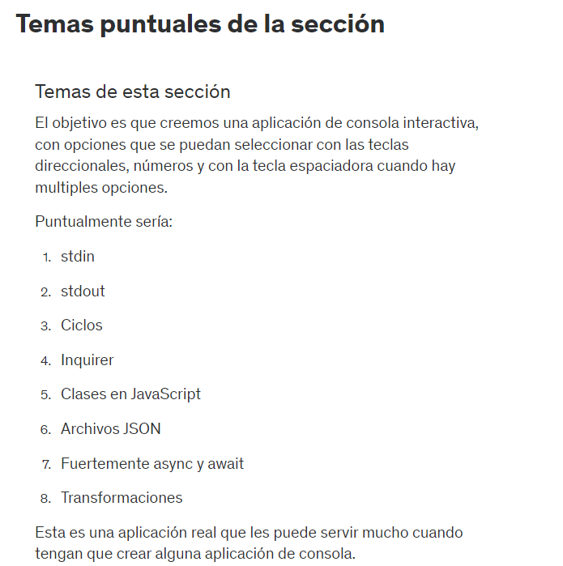

# 43. Introduccion a la seccion

# 44. Temas puntuales de la seccion



# 45. Demostracion del objetivo final de la seccion

# 46. Inicio del proyecto - Tareas por hacer

Para crear el package rapido usamos: npm init -y

```js
require('colors');
console.clear();
const main = async() => {
    
    console.log('Hola Mundo');
}

main();
```

# 47. stdin - stdout - Readline

# 48. Repetir el menu de forma infinita

# 49. Nota para la siguiente clase