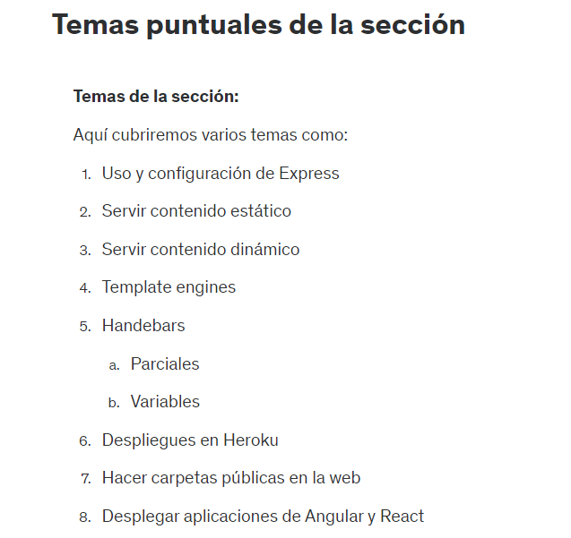
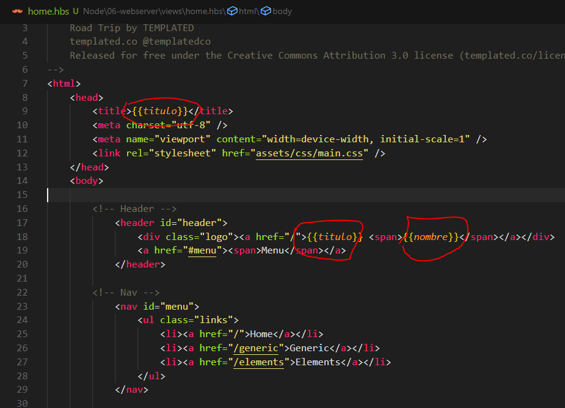
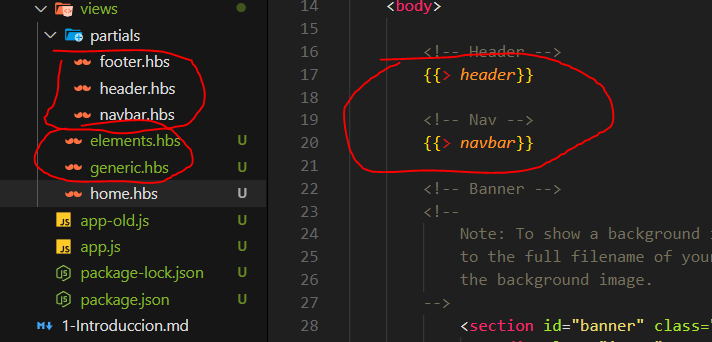

# SECCION 7: WEBSERVER - HTTP - EXPRESS -HBS

# 85. Introduccion a la seccion

# 86. Temas puntuales de la seccion



# 87. Inicio del proyecto - WebServer

```js
const http = require('http');

const server = http.createServer((req, res) => {
    res.writeHead(200, { 'Content-Type': 'text/plain' });
    res.write('Hola Mundo');
    res.end();
});

server.listen(8080, () => {
    console.log('Servidor escuchando en el puerto 8080');
});
```
<!-- 
const http = require('http'): Esta línea importa el módulo http de Node.js, que es parte de las bibliotecas estándar de Node.js y se utiliza para crear y manejar servidores HTTP.

const server = http.createServer((req, res) => {: Aquí se está creando un servidor HTTP usando el método createServer del módulo http. Este método toma una función de devolución de llamada (callback) como argumento, la cual será ejecutada cada vez que el servidor reciba una solicitud. Esta función de devolución de llamada recibe dos parámetros:
- req: Es un objeto que representa la solicitud que el cliente ha hecho al servidor. Contiene información sobre la solicitud, como la URL, los encabezados y el método HTTP.
- res: Es un objeto que se usa para enviar una respuesta al cliente. Con este objeto se pueden configurar los encabezados de la respuesta y enviar datos al cliente.

res.writeHead(200, { 'Content-Type': 'text/plain' }): Esta línea configura los encabezados de la respuesta HTTP. 200: Es el código de estado HTTP que indica que la solicitud ha sido exitosa. { 'Content-Type': 'text/plain' }: Es un objeto que define los encabezados de la respuesta. En este caso, se está indicando que el contenido de la respuesta será de tipo text/plain, es decir, texto sin formato.

res.write('Hola Mundo'): Esta línea escribe el cuerpo de la respuesta que se enviará al cliente. En este caso, se está enviando el texto "Hola Mundo". Este es el contenido que el cliente verá cuando acceda al servidor.

res.end(): Esta línea finaliza la respuesta. Es importante llamar a res.end() para indicar que ya no se enviarán más datos y que la respuesta está completa. Sin esta llamada, la conexión podría quedar abierta indefinidamente.

server.listen(8080, () => {: Aquí se indica al servidor que comience a escuchar solicitudes en el puerto 8080. El puerto es un número que identifica una conexión específica en la red. La función listen también acepta una función de devolución de llamada opcional que se ejecutará una vez que el servidor haya comenzado a escuchar.

console.log('Servidor escuchando en el puerto 8080'): Esta línea imprime un mensaje en la consola para indicar que el servidor está activo y escuchando solicitudes en el puerto 8080. Este mensaje aparecerá en la consola una vez que el servidor esté listo.

En resumen, este código crea un servidor HTTP simple que responde con "Hola Mundo" a cualquier solicitud entrante en el puerto 8080.
 -->

# 88. Request y Response

```js
const http = require('http');

const server = http.createServer((req, res) => {
    res.setHeader('Content-Disposition', 'attachment; filename=lista.csv');
    // res.writeHead(200, {'Content-Type' : 'application/json'})
    res.writeHead(200, { 'Content-Type': 'application/csv' });
    
    res.write('id, nombre\n');
    res.write('1, Fernando\n');
    res.write('2, Maria\n');
    res.write('3, Juan\n');
    res.write('4, Pedro\n');

    res.end();
});

server.listen(8080, () => {
    console.log('Servidor escuchando en el puerto 8080');
});
```

<!-- 
Content-Type es una cabecera HTTP que indica el tipo de medio de los datos en el cuerpo de la respuesta. Esto ayuda al cliente (por ejemplo, un navegador web) a entender cómo procesar o mostrar los datos recibidos. Aquí hay varios tipos comunes de Content-Type que se pueden utilizar:

- text/plain: Texto sin formato, sin ningún formato especial. Es útil para devolver respuestas de texto simples.

- text/html: Texto formateado como HTML. Esto se usa cuando quieres que el navegador interprete el contenido del cuerpo como HTML.

- application/json: Datos formateados como JSON. Es común en APIs que devuelven datos en formato JSON.

- application/xml o text/xml: Datos formateados como XML.

- application/javascript: Scripts de JavaScript que el navegador puede ejecutar.

- image/png, image/jpeg, etc.: Diferentes tipos de imágenes. Útil cuando se responden con archivos de imagen.
 -->

# 89. Introduccion a Express

```js
const express = require('express')
const app = express()

app.get('/', (req, res) => {
    res.send('Home Page');
});

app.get('/hola-mundo', (req, res) => {
    res.send('Hola mundo en su respectiva ruta')
});

app.get('*', (req, res) => {
    res.send('404 Page Not Found')
});
app.listen(8080)
```

# 90. Servir contenido estático

```js
const express = require('express')
const app = express()

// Servir contenido extático
app.use(express.static('public'));

app.get('/hola-mundo', (req, res) => {
    res.send('Hola mundo en su respectiva ruta')
});

app.get('*', (req, res) => {
    res.sendFile(__dirname + '/public/404.html');
});
app.listen(8080)
```

```html
<!DOCTYPE html>
<html lang="en">
<head>
    <meta charset="UTF-8">
    <meta name="viewport" content="width=device-width, initial-scale=1.0">
    <title>Node - Express</title>
</head>
<body>
    <h1>Holaasss Mundo</h1>
    <hr>
</body>
</html>
```

```html
<!DOCTYPE html>
<html lang="en">
<head>
    <meta charset="UTF-8">
    <meta name="viewport" content="width=device-width, initial-scale=1.0">
    <title>Document</title>
</head>
<body>
    <h1>404 - Pagina no encontrada</h1>
    <a href="/">Ir a Home</a>
</body>
</html>
```

# 91. Servir un sitio web completo

```js
//app.js
const express = require('express')
const app = express()

// Servir contenido extático
app.use(express.static('public'));

app.get('/', (req, res) => {
    res.sendFile(__dirname + '/public/index.html');
});

app.get('/generic', (req, res) => {
    res.sendFile(__dirname + '/public/generic.html');
});

app.get('/elements', (req, res) => {
    res.sendFile(__dirname + '/public/elements.html');
});

app.get('*', (req, res) => {
    res.sendFile(__dirname + '/public/404.html');
});
app.listen(8080)
```

```html
<!-- Archivo index.html, modificar esta parte debido a la modificacion en app.js -->
 		<!-- Nav -->
			<nav id="menu">
				<ul class="links">
					<li><a href="/">Home</a></li>
					<li><a href="/generic">Generic</a></li>
					<li><a href="/elements">Elements</a></li>
				</ul>
			</nav>
```

# 92. Handlebars

Recursos:
- https://www.npmjs.com/package/handlebars
- https://github.com/pillarjs/hbs

<!-- 
Handlebars es un motor de plantillas para JavaScript que te permite generar HTML dinámico en tus aplicaciones. Es muy útil en aplicaciones Node.js cuando necesitas renderizar vistas en el servidor. Handlebars te permite separar la lógica de negocio de la presentación, lo que facilita la creación de interfaces de usuario dinámicas.

En resumen, con Handlebars puedes crear plantillas con marcadores de posición (placeholders) que luego se reemplazan con datos reales cuando se renderiza la vista. Esto es muy útil para construir páginas web dinámicas basadas en los datos que maneja tu aplicación.
 -->

```js
// App.js
const express = require('express')
const app = express()

app.set('view engine', 'hbs');

/*Se agrego/modifico lo siguiente*/

// Servir contenido extático
app.use(express.static('public'));

app.get('/', (req, res) => {
    res.render('home');
});
/*Hasta aqui*/

app.get('/generic', (req, res) => {
    res.sendFile(__dirname + '/public/generic.html');
});

app.get('/elements', (req, res) => {
    res.sendFile(__dirname + '/public/elements.html');
});

app.get('*', (req, res) => {
    res.sendFile(__dirname + '/public/404.html');
});
app.listen(8080)
```

# 93. Argumentos desde el controlador

```js
const express = require('express')
const app = express()

app.set('view engine', 'hbs');

// Servir contenido extático
app.use(express.static('public'));

app.get('/', (req, res) => {
    res.render('home', {
        nombre: 'Walter Suel',
        titulo: 'Curso Node'
    });
});

app.get('/generic', (req, res) => {
    res.sendFile(__dirname + '/public/generic.html');
});

app.get('/elements', (req, res) => {
    res.sendFile(__dirname + '/public/elements.html');
});

app.get('*', (req, res) => {
    res.sendFile(__dirname + '/public/404.html');
});
app.listen(8080)
```

<!-- Se modifico los siguientes elementos de mi archivo home.hbs -->



# 94. Usando parciales con HBS

```js
const express = require('express')
const app = express()

//Handlebars
const hbs = require('hbs');
hbs.registerPartials(__dirname + '/views/partials');

app.set('view engine', 'hbs');

// Servir contenido extático
app.use(express.static('public'));

app.get('/', (req, res) => {
    res.render('home', {
        nombre: 'Walter Suel',
        titulo: 'Curso Node'
    });
});

app.get('/generic', (req, res) => {
    res.render('generic', {
        nombre: 'Walter Suel',
        titulo: 'Curso Node'
    });
});

app.get('/elements', (req, res) => {
    res.render('elements', {
        nombre: 'Walter Suel',
        titulo: 'Curso Node'
    });
});

app.get('*', (req, res) => {
    res.sendFile(__dirname + '/public/404.html');
});
app.listen(8080)
```

<!-- Creamos lo mismo para los diferentes archivos en formato .hbs, tal como se muestra en la imagen -->




# 95. Preparar WebServer para subirlo a un hosting

# 96. Desplegar Aplicacion en Railway.app